## Mechanical Engineer 
### Manufacturing Enthusiast | Researcher

## Technical Skills 
- AutoCAD 
- SolidWorks 
- Python 
- Simulink 
- ANSYS
- MATLAB
- PowerBI
- Microsoft Office

## Education
- 🎓 **B.Sc in Mechanical Engineering** Bangladesh University of Engineering and Technology (BUET) (_November 2023_)

## Publications
1. **Munem M**, Rahman KA. Comprehensive CSTR Control Integration for Enhanced Ethanol Production: PI, PID, MPC, Hybrid MPC-PID Strategies in Nonlinear Bioreactors. PID, MPC, Hybrid MPC-PID Strategies in Nonlinear Bioreactors (June 24, 2024). 2024 Jun 24.
[Publication](https://papers.ssrn.com/sol3/papers.cfm?abstract_id=4874366)

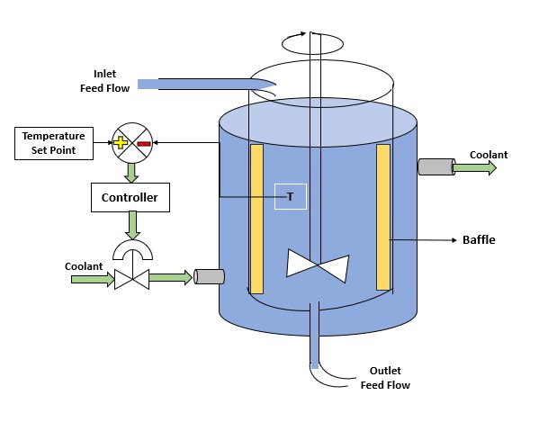
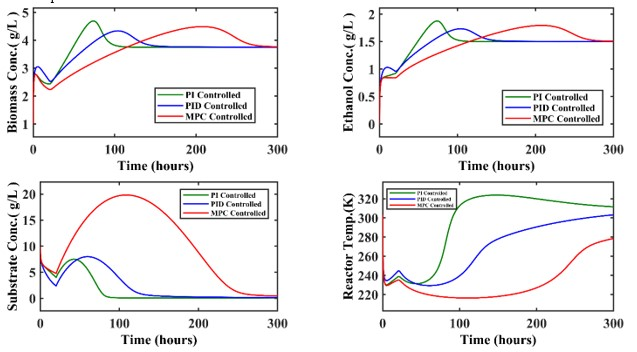

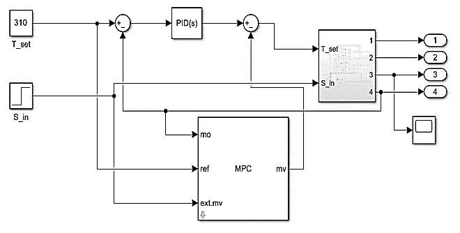
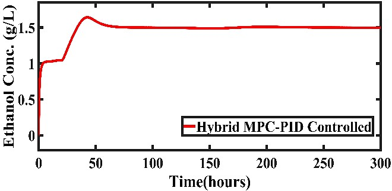

## Current Research Works

- 🛠 Mechanical and Thermal Performance Analysis of 3D Printed Materials compared to PVC and Cast-Iron Products: A Data Driven Simulation Study and Real-World Applications in Additive Manufacturing.

- 🔧 Herringbone Gear Transmission for Marine Gearbox.

## Academic Projects

### Shell and Tube Heat Exchanger
(https://www.mdpi.com/1424-8220/22/8/3048)

### An Automated Door Control System

## Work Experience
💼 **Asst. Engineer @ [Anwar Group of Industries](https://www.anwargroup.com/) (_Feb 2024 - Present_)**
- Optimize business operations through comprehensive planning and strategic initiatives
- Developing new products, simulation, testing, feasibility studies and project profiles
- Develop and implement strategies for the optimal utilization of machinery and materials

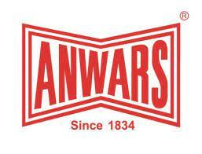
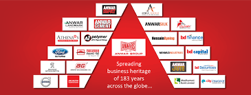

💼 **Founder @ SantarHut  (_2018-2021_)**
- A smart Supply Chain Management System

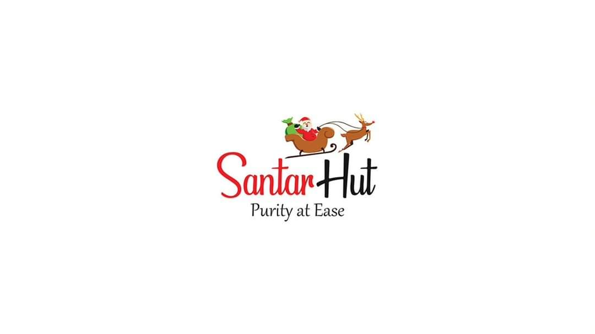

## Professional Projects

#### Cutting & Grinding Disc Plant Setup
-  Spearheaded the entire plant setup: from machinery selection to layout design
-  Responsible for operational strategies, product development, and market analysis
-  Collaborated with global suppliers for high-precision machinery

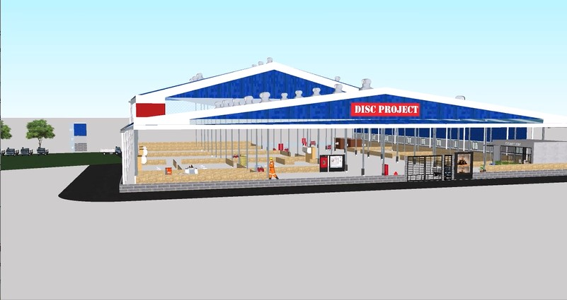
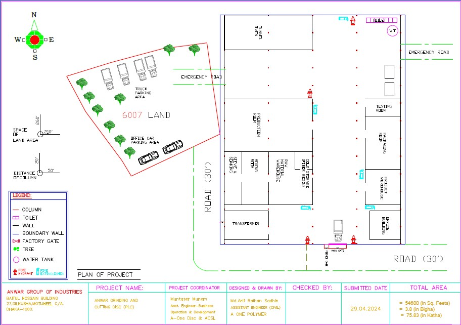

#### LEED Certification for Cement Sheet Plant Project
-  Facilitated the process to obtain **LEED certification** for the **Anwar Cement Sheet Limited** (ACSL) factory. 
-  Managed the submission of data for eco-friendly materials, energy efficiency, and waste reduction in compliance with LEED standards.
-  Responsibilities included streamlining communication between departments, organizing data for sustainable performance metrics, and ensuring timely submissions to the certification body.

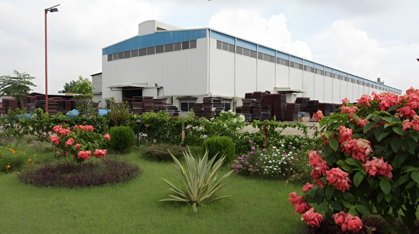
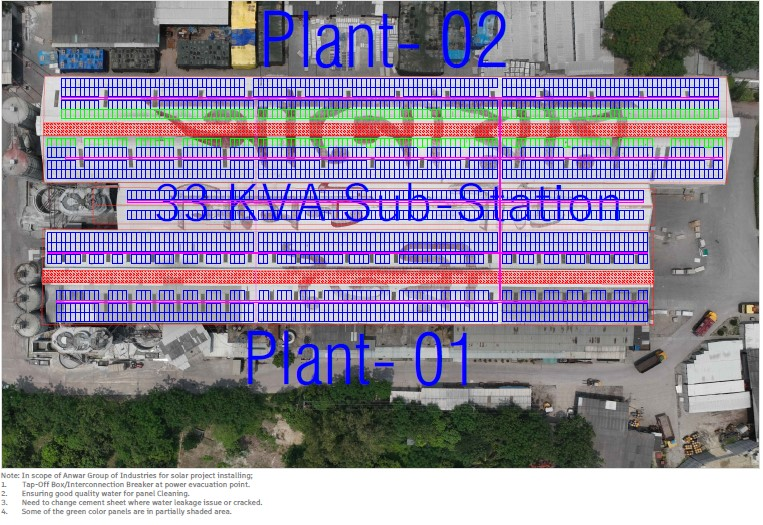

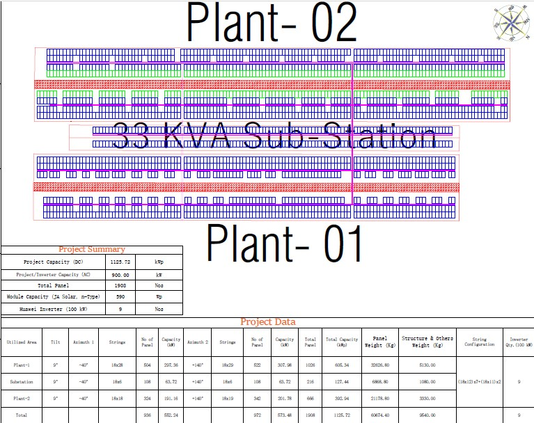
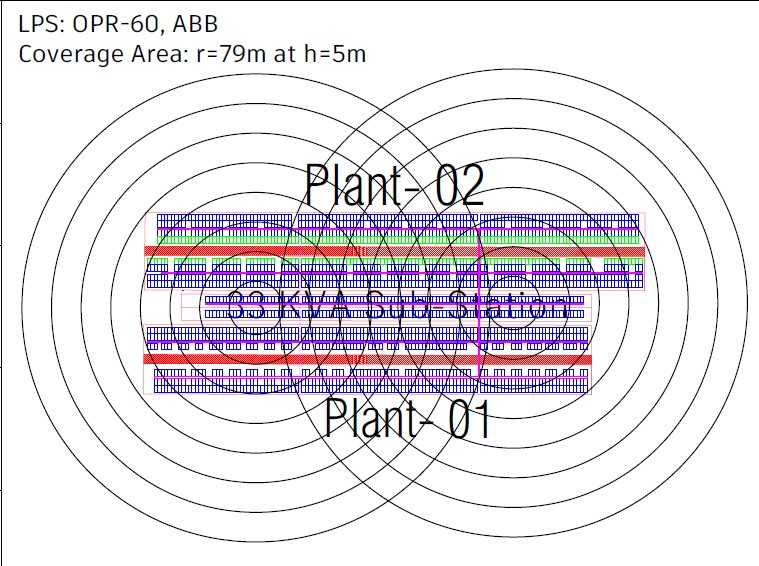

###  Let's Connect!
-  [Email me](mailto:muntasermunem@gmail.com)
-  [LinkedIn](https://www.linkedin.com/in/muntaser-munem?utm_source=share&utm_campaign=share_via&utm_content=profile&utm_medium=android_app)
-  Academic CV
-  **Fun Fact**:
  I believe every machine has its own story to tell — it’s up to the engineer to listen and optimize it.

---

###  Quote I Live By
_"Machines take me by surprise with great frequency." — Alan Turing_

